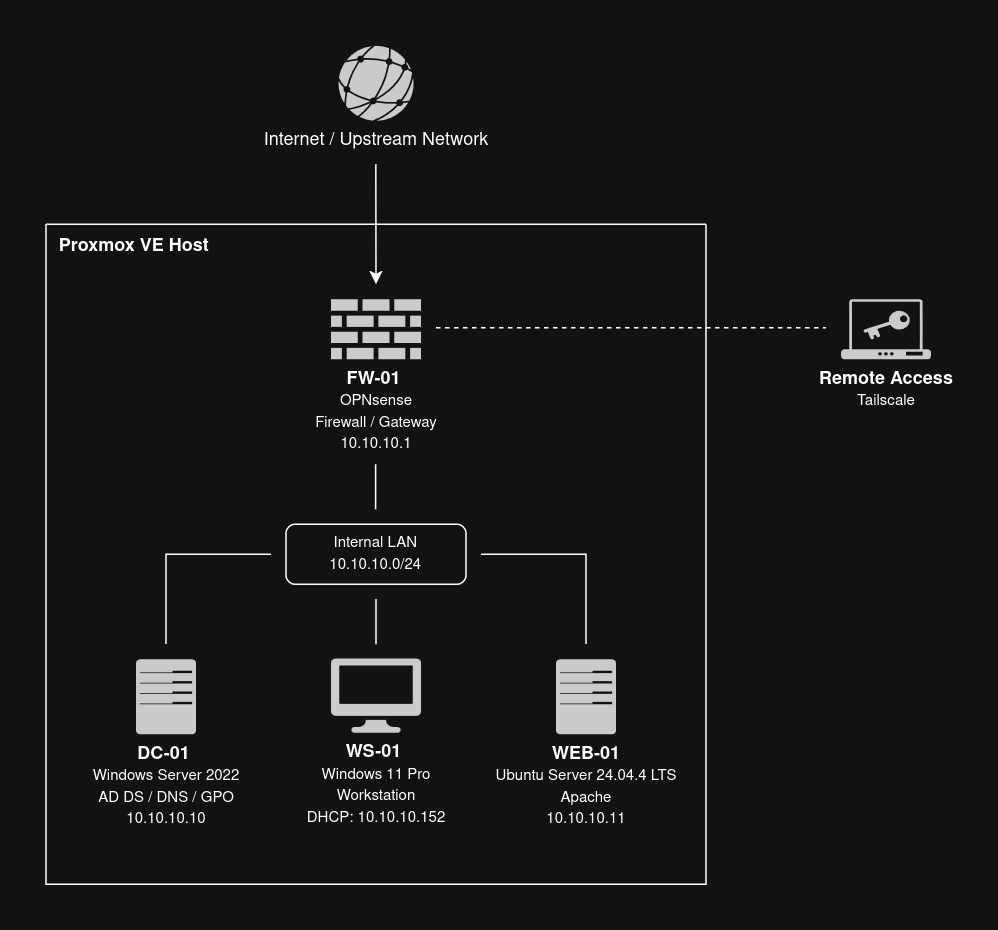

# PrimeSec Infrastructure

     

PrimeSec Infrastructure is a virtualized small-business infrastructure lab built to simulate a basic internal corporate network.

The environment includes an OPNsense firewall, a Windows Server domain controller, a domain-joined Windows workstation, and an Ubuntu Apache web server. Each component is documented with configuration notes, validation evidence, and supporting screenshots.

---

## Implemented Environment

| Component | Role                                        | Key Details                                                                             | Documentation                          |
| --------- | ------------------------------------------- | --------------------------------------------------------------------------------------- | -------------------------------------- |
| FW-01     | Firewall, gateway, NAT, DHCP, remote access | OPNsense, LAN gateway `10.10.10.1`, DHCP scope `10.10.10.100 - 10.10.10.199`, Tailscale | [FW-01 Docs](docs/fw-01/overview.md)   |
| DC-01     | Domain controller, DNS, Group Policy        | Windows Server 2022, AD DS, domain `primesec.local`, IP `10.10.10.10`                   | [DC-01 Docs](docs/dc-01/overview.md)   |
| WS-01     | Managed Windows workstation                 | Windows 11 Pro, domain joined, DHCP lease `10.10.10.152`                                | [WS-01 Docs](docs/ws-01/overview.md)   |
| WEB-01    | Internal Linux web server                   | Ubuntu Server 24.04.4 LTS, Apache HTTP Server, UFW, IP `10.10.10.11`                    | [WEB-01 Docs](docs/web-01/overview.md) |

---

## Architecture

The lab is deployed on Proxmox VE using an isolated internal network behind FW-01.

  

---

## Network Summary

| Item                    | Value                         |
| ----------------------- | ----------------------------- |
| Internal network        | `10.10.10.0/24`               |
| Default gateway         | FW-01 / `10.10.10.1`          |
| DHCP provider           | FW-01                         |
| DHCP scope              | `10.10.10.100 - 10.10.10.199` |
| Domain DNS authority    | DC-01 / `10.10.10.10`         |
| Active Directory domain | `primesec.local`              |
| Remote access           | Tailscale on FW-01            |

---

## Documentation

| Area         | Links                                                                                                                                           |
| ------------ | ----------------------------------------------------------------------------------------------------------------------------------------------- |
| Architecture | [Design Decisions](docs/architecture/design-decisions.md) · [Diagram Source](diagrams/architecture.drawio)                                      |
| Networking   | [DNS Configuration](docs/networking/dns.md)                                                                                                     |
| Components   | [FW-01](docs/fw-01/overview.md) · [DC-01](docs/dc-01/overview.md) · [WS-01](docs/ws-01/overview.md) · [WEB-01](docs/web-01/overview.md)         |
| Validation   | [FW-01](docs/fw-01/validation.md) · [DC-01](docs/dc-01/validation.md) · [WS-01](docs/ws-01/validation.md) · [WEB-01](docs/web-01/validation.md) |
| Reports      | [Group Policy Reports](reports/gpo/)                                                                                                            |

---

## Scope

PrimeSec Infrastructure is a controlled infrastructure lab for deployment, documentation, and validation. It is not intended to represent a production enterprise deployment or a full web application platform.
