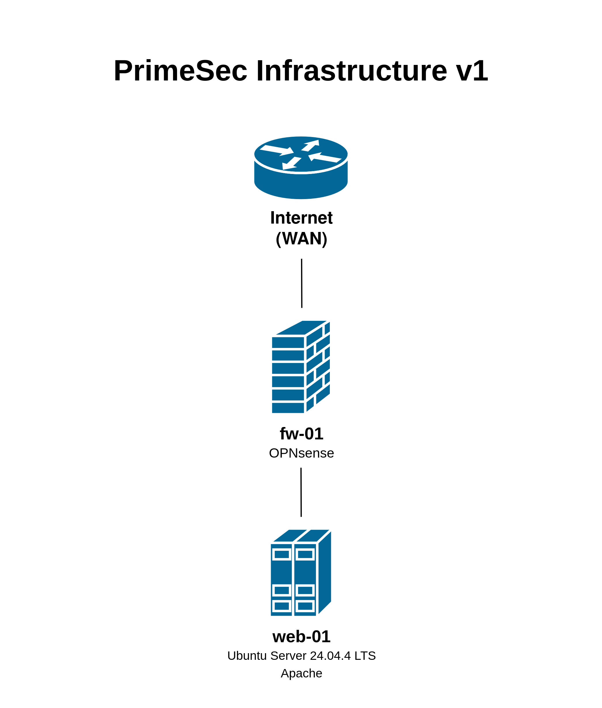

# PrimeSec Infrastructure

Enterprise infrastructure lab focused on systems administration, networking, virtualization and security.

## Architecture

## Current Components

### fw-01
**Platform:** OPNsense 26.1.6_2

Features:
- NAT
- DHCP
- Firewall
- Tailscale Subnet Routing

### web-01
**Platform:** Ubuntu Server 24.04.4 LTS

Services:
- Apache HTTP Server
- Static IP Configuration

## Network

| Component | IP Address |
|------------|------------|
| fw-01 (LAN) | 10.10.10.1 |
| web-01 | 10.10.10.11 |

## Roadmap

Planned components:

- Windows Server Domain Controller
- Active Directory
- DNS
- DHCP Integration
- Monitoring
- Centralized Logging
- Security Tooling
