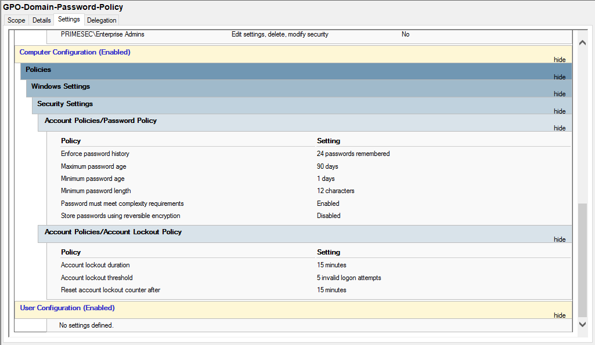
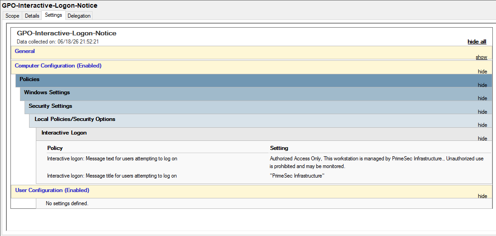
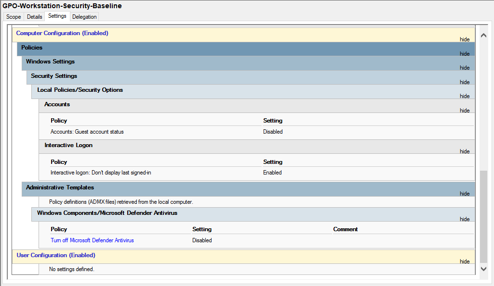
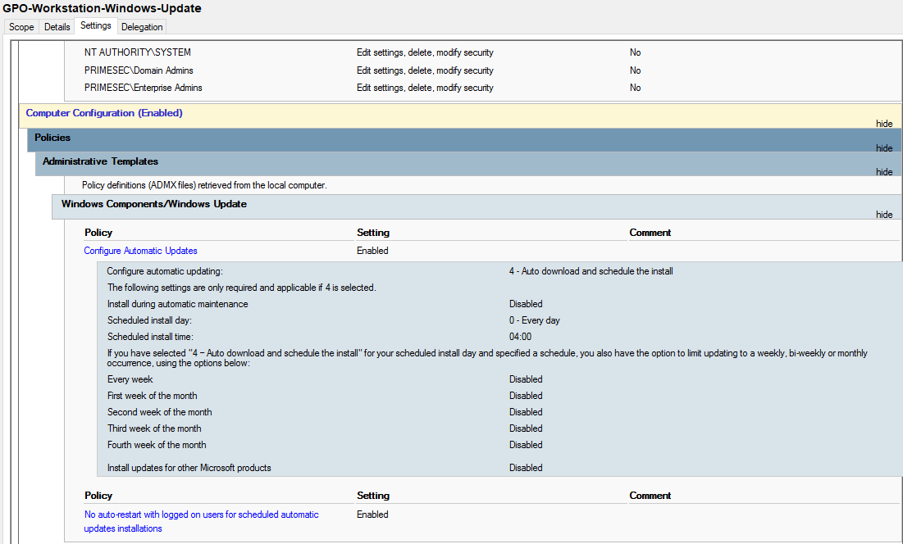

# DC-01 Group Policy

## Purpose

This document records the Group Policy configuration managed through `DC-01`.

The implemented GPOs provide centralized configuration for domain password requirements, workstation security settings, Windows Update behavior, and the interactive logon notice.

---

## Policy Model

Group Policy is separated between domain-level and workstation-level controls.

| Scope | Purpose |
| --- | --- |
| `primesec.local` | Domain-wide account and password policy |
| `PRIMESEC/Workstations` | Workstation security, update, and logon notice settings |

This keeps identity-related settings at the domain level and endpoint configuration under the workstation OU.

### Evidence

---

## Implemented GPOs

| GPO | Scope |
| --- | --- |
| `GPO-Domain-Password-Policy` | `primesec.local` |
| `GPO-Interactive-Logon-Notice` | `PRIMESEC/Workstations` |
| `GPO-Workstation-Security-Baseline` | `PRIMESEC/Workstations` |
| `GPO-Workstation-Windows-Update` | `PRIMESEC/Workstations` |

---

## Domain Password Policy

`GPO-Domain-Password-Policy` defines domain account password and lockout requirements.

| Setting | Value |
| --- | --- |
| Enforce password history | `24 passwords remembered` |
| Maximum password age | `90 days` |
| Minimum password age | `1 day` |
| Minimum password length | `12 characters` |
| Password complexity | `Enabled` |
| Reversible password encryption | `Disabled` |
| Account lockout threshold | `5 invalid logon attempts` |
| Account lockout duration | `15 minutes` |
| Reset account lockout counter | `15 minutes` |

### Evidence

---

## Interactive Logon Notice

`GPO-Interactive-Logon-Notice` configures a logon banner for domain workstations.

| Setting | Value |
| --- | --- |
| Message title | `PrimeSec Infrastructure` |
| Message text | `Authorized Access Only. This workstation is managed by PrimeSec Infrastructure. Unauthorized use is prohibited and may be monitored.` |

### Evidence

---

## Workstation Security Baseline

`GPO-Workstation-Security-Baseline` applies workstation security settings through Group Policy.

| Setting | Value |
| --- | --- |
| Guest account status | `Disabled` |
| Do not display last signed-in user | `Enabled` |
| Turn off Microsoft Defender Antivirus | `Disabled` |

The Microsoft Defender setting means the GPO does not disable Microsoft Defender Antivirus.

### Evidence

---

## Windows Update Policy

`GPO-Workstation-Windows-Update` configures automatic update behavior for domain workstations.

| Setting | Value |
| --- | --- |
| Configure Automatic Updates | `Enabled` |
| Automatic update mode | `4 - Auto download and schedule the install` |
| Scheduled install day | `0 - Every day` |
| Scheduled install time | `04:00` |
| No auto-restart with logged-on users | `Enabled` |

### Evidence

---

## Exported Reports

Group Policy reports are available under `reports/gpo/`.

| Report | GPO |
| --- | --- |
| [GPO-Domain-Password-Policy](../../reports/gpo/GPO-Domain-Password-Policy.html) | `GPO-Domain-Password-Policy` |
| [GPO-Interactive-Logon-Notice](../../reports/gpo/GPO-Interactive-Logon-Notice.html) | `GPO-Interactive-Logon-Notice` |
| [GPO-Workstation-Security-Baseline](../../reports/gpo/GPO-Workstation-Security-Baseline.html) | `GPO-Workstation-Security-Baseline` |
| [GPO-Workstation-Windows-Update](../../reports/gpo/GPO-Workstation-Windows-Update.html) | `GPO-Workstation-Windows-Update` |

---

## Validation Reference

Group Policy validation is documented in [DC-01 Validation](validation.md).

Validation covers:

- GPO linking
- Password policy settings
- Interactive logon notice settings
- Workstation security baseline settings
- Windows Update policy settings
