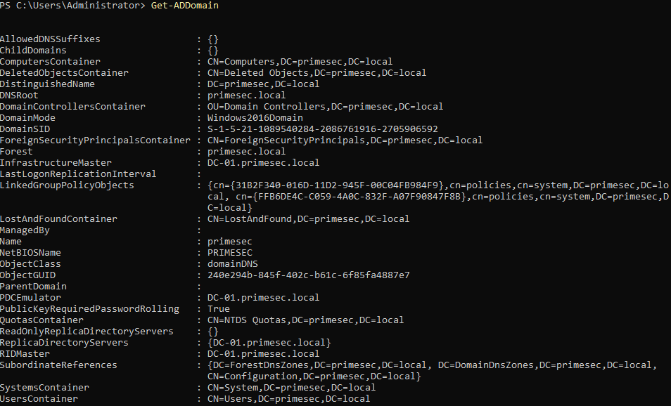
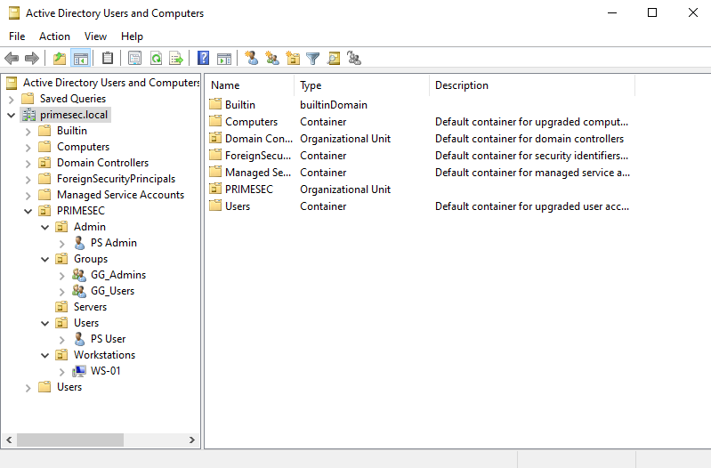

# DC-01 Overview

## Purpose

DC-01 is the Domain Controller for the PrimeSec Infrastructure environment.

It runs Windows Server 2022 and provides Active Directory Domain Services, Active Directory Integrated DNS, and Group Policy management for the `primesec.local` domain.

---

## Key Responsibilities

DC-01 is responsible for:

- Domain authentication
- Active Directory administration
- DNS name resolution for the AD domain
- Group Policy deployment
- Domain computer management
- Security policy configuration

---

## Server Specifications

| Property | Value |
|----------|-------|
| Hostname | DC-01 |
| Operating System | Windows Server 2022 |
| Platform | Proxmox VE |
| IP Address | 10.10.10.10 |
| Domain Name | primesec.local |
| NetBIOS Name | PRIMESEC |
| DNS Configuration | Active Directory Integrated DNS |
| Server Role | Domain Controller |

---

## Installed Roles and Services

### Active Directory Domain Services

Active Directory Domain Services provides identity and access management for the domain.

Implemented capabilities include:

- Domain authentication
- User and group administration
- Organizational Unit management
- Group Policy administration
- Computer account management
- Security policy configuration

DC-01 is the central Windows administration point for the current Phase 1 environment.

---

### DNS

Active Directory Integrated DNS was deployed with AD DS.

DNS responsibilities include:

- Internal name resolution
- Domain controller service location
- Active Directory service discovery
- Dynamic DNS record registration
- Forward lookup zone management

Domain-joined systems use DC-01 as their DNS server so they can locate domain services correctly.

### Evidence


---

## Active Directory Design

### Domain Structure

A single-forest, single-domain Active Directory environment was deployed.

| Property | Value |
|----------|-------|
| Forest Root Domain | primesec.local |
| Domain Type | Single Forest, Single Domain |
| NetBIOS Name | PRIMESEC |

This keeps the domain structure simple and appropriate for the current lab scope.

### Evidence



---

### Organizational Unit Hierarchy

The Active Directory structure separates administrative accounts, groups, servers, users, and workstations.

```text
PRIMESEC
├── Admin
├── Groups
├── Servers
├── Users
└── Workstations
```

This hierarchy supports:

- Targeted Group Policy deployment
- Logical object organization
- Simpler administration
- Room for additional systems later

### Evidence



---

## Group Policy

Group Policy was implemented to manage domain and workstation configuration.

Implemented policies include:

- GPO-Domain-Password-Policy
- GPO-Interactive-Logon-Notice
- GPO-Workstation-Security-Baseline
- GPO-Workstation-Windows-Update

Exported reports are stored under:

```text
reports/gpo/
```

Group Policy application is validated on WS-01 using GPResult evidence.

---

## Relationship with Other Systems

### FW-01

FW-01 provides the default gateway, NAT, DHCP, firewalling, and remote administration path.

DC-01 uses the internal network behind FW-01.

### WS-01

WS-01 is joined to the `primesec.local` domain.

It uses DC-01 for:

- Domain authentication
- DNS resolution for the AD domain
- Group Policy processing

### WEB-01

WEB-01 is a Linux server on the same internal network.

Systems that need to resolve internal `primesec.local` records should use DC-01 as the internal DNS authority.

---

## Related Documentation

| Document | Description |
|----------|-------------|
| [Group Policy](group-policy.md) | Implemented GPOs and exported reports |
| [Validation](validation.md) | Active Directory, DNS, and Group Policy validation |
| [DNS Configuration](../networking/dns.md) | DNS responsibility model |

---

## Summary

DC-01 provides the Windows domain services for the Phase 1 environment.

It hosts the `primesec.local` Active Directory domain, provides integrated DNS, manages Group Policy, and supports the domain-joined workstation WS-01.