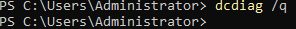
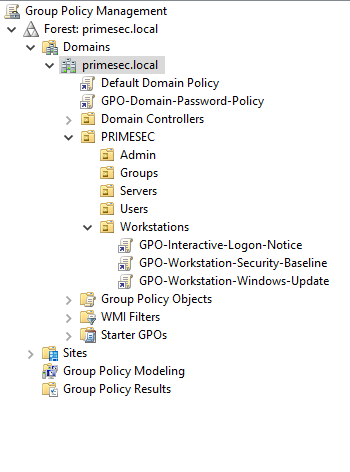

# Validation

Validation activities were performed to confirm that the Active Directory deployment, DNS infrastructure, and Group Policy implementation are operating as designed.

The objective of validation is to verify the operational state of the environment rather than the implementation process itself. These checks provide evidence that core services are functioning correctly and that the domain infrastructure is capable of supporting centralized authentication, policy management, and workstation administration.

The validation process focused on domain configuration, directory structure, DNS functionality, domain controller health, policy deployment, and workstation policy application.

---

## Domain Validation

The Active Directory domain configuration was validated using PowerShell to confirm the successful deployment of the forest and domain services.

The validation confirms:

- Successful creation of the `primesec.local` domain
- Successful creation of the Active Directory forest
- Correct NetBIOS configuration (`PRIMESEC`)
- Proper identification of the Domain Controller
- Successful registration of Active Directory services

The results verify that DC-01 is operating as the authoritative Domain Controller for the environment and that the Active Directory deployment was completed successfully.

Validating domain information is important because Active Directory serves as the central identity platform for the infrastructure. Incorrect domain configuration can affect authentication, authorization, DNS integration, and Group Policy processing across all domain-joined systems.

### Evidence


---

## Active Directory Structure Validation

The Organizational Unit (OU) hierarchy was validated to confirm that the planned directory structure was successfully implemented.

The following Organizational Units were verified:

```text
PRIMESEC
├── Admin
├── Groups
├── Servers
├── Users
└── Workstations
```

The validation confirms that administrative accounts, user accounts, security groups, servers, and workstations can be logically separated within the directory.

A properly structured OU hierarchy is important because it provides administrative organization and enables targeted Group Policy deployment. The structure also establishes a scalable foundation for future infrastructure growth and additional policy implementation.

### Evidence


---

## DNS Validation

The DNS service was validated to confirm proper integration with Active Directory and successful operation of the name resolution infrastructure.

Validation confirmed:

- Active Directory Integrated DNS is operational
- Forward Lookup Zones are present and functional
- Domain records were successfully created
- Host records are available for managed systems
- Active Directory service records are present

The DNS infrastructure contains records for:

- DC-01
- FW-01
- WS-01

Active Directory relies heavily on DNS for service discovery, authentication, and domain controller location. Domain-joined systems use DNS to locate authentication services and other directory resources required for normal operation.

A healthy DNS deployment is therefore essential to the overall functionality of the domain environment.

### Evidence


---

## Domain Controller Health Validation

Domain Controller health was validated using the Microsoft DCDIAG utility.

The command `dcdiag /q` was executed to perform diagnostic validation of Active Directory services while suppressing normal output and displaying only detected issues.

The validation returned no reported errors.

A clean result indicates that no domain controller health issues were detected during the validation process.

This outcome confirms that:

- Active Directory services are operating normally
- DNS integration is functioning correctly
- Core domain controller services are healthy
- No critical replication or service validation issues were detected

DCDIAG is a commonly used administrative tool for validating Active Directory health and identifying configuration or operational issues that may affect domain functionality.

### Evidence



---

## Group Policy Validation

Group Policy deployment was validated through the Group Policy Management Console to confirm successful policy linking and policy assignment.

The validation confirmed that:

- Domain-level policies are linked correctly
- Workstation-specific policies are linked to the appropriate Organizational Unit
- Policy inheritance is functioning as expected
- Centralized management is operational

The following policies were verified:

- GPO-Domain-Password-Policy
- GPO-Interactive-Logon-Notice
- GPO-Workstation-Security-Baseline
- GPO-Workstation-Windows-Update

Policy validation is important because improperly linked or misconfigured policies may not be applied to target systems. Successful validation confirms that the Active Directory structure and policy deployment model are functioning correctly.

### Evidence



---

## Interactive Logon Notice Validation

The interactive logon notice was validated from the workstation perspective to confirm successful policy application on a domain-joined endpoint.

The validation confirmed that:

- The workstation successfully received the policy
- The logon banner is displayed prior to authentication
- Group Policy processing completed successfully
- User-facing policy settings are applied as expected

The displayed banner presents an authorized access notice and organizational message before users are permitted to sign in.

This validation demonstrates successful communication between Active Directory, Group Policy, and the managed workstation. It also confirms that workstation-targeted policies are being applied correctly within the environment.

### Evidence


---

## Validation Summary

Validation activities confirmed the successful operation of the Active Directory infrastructure deployed on DC-01.

The completed verification process demonstrated:

- Successful Active Directory deployment
- Functional forest and domain configuration
- Operational Organizational Unit structure
- Healthy Active Directory Integrated DNS services
- Healthy Domain Controller status
- Successful Group Policy deployment and linking
- Successful workstation policy application

The validation results provide evidence that the environment is functioning as designed and that core identity, authentication, name resolution, and policy management services are operational.

Collectively, these validation activities confirm that DC-01 is operating as the central identity and management platform for the PrimeSec Infrastructure environment, providing a stable foundation for centralized administration, workstation management, and future infrastructure expansion.