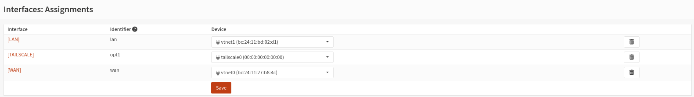
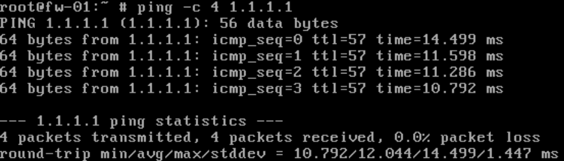
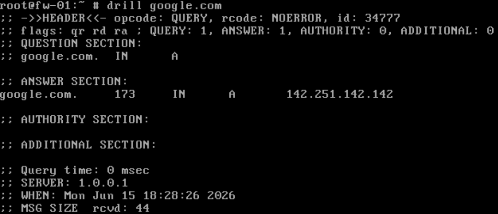
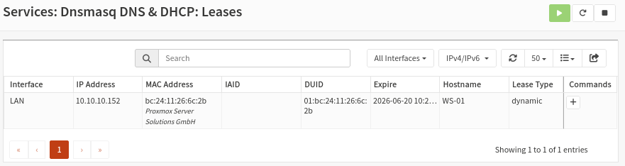
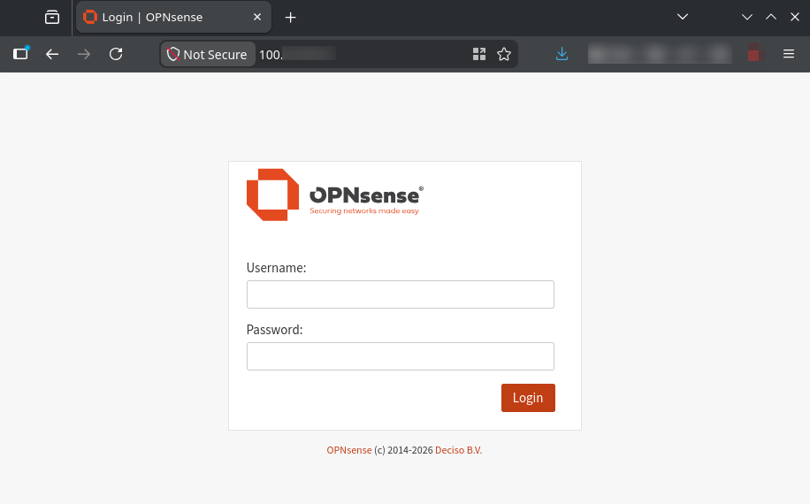

# FW-01 Validation

## Purpose

This document records validation evidence for `FW-01`.

Validation covers the firewall's role as the internal gateway, NAT device, DHCP provider, firewall policy enforcement point, and Tailscale remote administration entry point.

---

## Validation Summary

| Check | Result |
| -------- | -------- |
| Interface assignments | Passed |
| External connectivity | Passed |
| External DNS resolution | Passed |
| DHCP scope and lease | Passed |
| Tailscale Web GUI reachability | Passed |

---

## Interface Assignment Validation

### Objective

Verify that the expected OPNsense interfaces are assigned.

### Result

Evidence shows the following interface assignments:

| Interface | Identifier | Device |
| -------- | -------- | -------- |
| `LAN` | `lan` | `vtnet1` |
| `TAILSCALE` | `opt1` | `tailscale0` |
| `WAN` | `wan` | `vtnet0` |

### Evidence



---

## External Connectivity Validation

### Objective

Verify that `FW-01` can reach an external network destination.

### Procedure

```bash
ping -c 4 1.1.1.1
```

### Result

The ping test shows successful external connectivity from `FW-01`.

Recorded output:

- `4` packets transmitted
- `4` packets received
- `0.0%` packet loss

### Evidence



---

## External DNS Resolution Validation

### Objective

Verify that `FW-01` can resolve external domain names.

### Procedure

```bash
drill google.com
```

### Result

The DNS query shows external name resolution from `FW-01`.

Recorded output:

- Query status returned `NOERROR`
- A valid `A` record response was returned for `google.com`
- Resolver shown in the output is `1.0.0.1`

This check validates external DNS resolution from the firewall. It does not make `FW-01` authoritative for the Active Directory DNS namespace.

### Evidence



---

## DHCP Validation

### Objective

Verify that `FW-01` provides DHCP on the internal `LAN` interface and that a client receives a dynamic lease.

### Result

DHCP is configured on `FW-01` for the internal network.

Configuration:

- Interface: `LAN`
- DHCP scope: `10.10.10.100 - 10.10.10.199`
- DHCP DNS server: `10.10.10.10`
- DHCP domain/search suffix: `primesec.local`

Observed lease:

- Client: `WS-01`
- Lease address: `10.10.10.152`
- Lease type: `dynamic`

`WS-01` receives a dynamic lease from the configured `FW-01` DHCP scope.

### Evidence




---

## Tailscale Remote Administration Validation

### Objective

Verify that the OPNsense Web GUI is reachable through Tailscale.

### Result

The OPNsense Web GUI login page is reachable through a redacted Tailscale address.

Recorded result:

- OPNsense Web GUI login page displayed
- Access used a redacted Tailscale address
- Public management port exposure was not required for this access model

This validates the remote administration path up to the OPNsense Web GUI.

### Evidence



---

## DNS Authority Note

`FW-01` provides DHCP for the internal network and distributes `DC-01` as the DNS server for domain clients.

`DC-01` / `10.10.10.10` remains authoritative for the `primesec.local` Active Directory namespace.

| Function | System |
| -------- | -------- |
| Default gateway | `FW-01` / `10.10.10.1` |
| DHCP provider | `FW-01` |
| Active Directory DNS authority | `DC-01` / `10.10.10.10` |
| Active Directory domain | `primesec.local` |

`FW-01` DNS validation only verifies external name resolution from the firewall.

It does not change the DNS authority model for the Active Directory domain.

---

## Conclusion

`FW-01` validation covers interface assignment, external connectivity, external DNS resolution, DHCP operation, dynamic lease assignment, and Tailscale-based Web GUI reachability.

These checks support the documented role of `FW-01` as the gateway, NAT device, DHCP provider, firewall policy enforcement point, and Tailscale remote administration entry point.