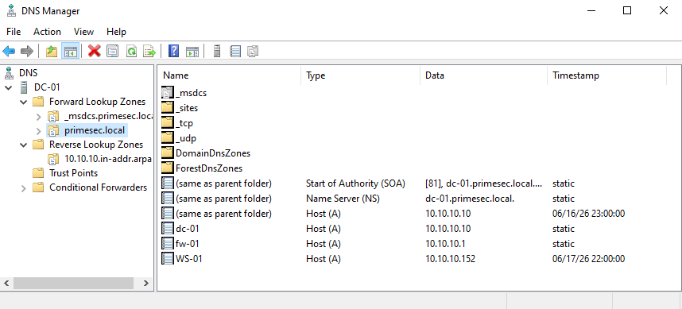
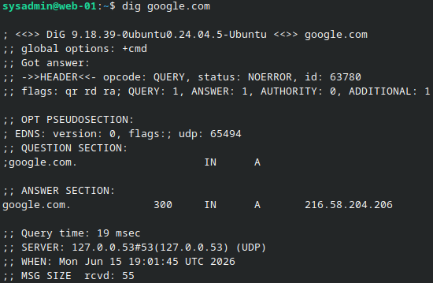

# DNS Configuration

## Purpose

This document defines the DNS model used by the PrimeSec Infrastructure environment.

DNS is a critical service in this project because Active Directory depends on DNS for domain controller discovery, authentication, service location, and normal domain-joined system operation.

---

## Final DNS Model

The final Active Directory domain namespace is:

```text
primesec.local
```

The authoritative internal DNS server for the Active Directory domain is:

```text
DC-01 / 10.10.10.10
```

DC-01 provides Active Directory Integrated DNS for the internal domain.

---

## DNS Responsibility Matrix

| Function | Responsible System | Notes |
|----------|--------------------|-------|
| Active Directory DNS | DC-01 | Authoritative for `primesec.local` |
| Domain controller service discovery | DC-01 | Required for AD authentication and domain operations |
| DNS for domain-joined systems | DC-01 / 10.10.10.10 | Domain-joined systems use DC-01 as DNS |
| Default gateway | FW-01 / 10.10.10.1 | FW-01 remains the internal network gateway |
| DHCP | FW-01 | DHCP is configured to hand out DC-01 as DNS |
| Upstream or external DNS forwarding for non-domain or network-level services | FW-01 | FW-01 may provide forwarding, but is not authoritative for AD DNS |

---

## Active Directory DNS

DC-01 provides DNS services for the `primesec.local` domain.

Its DNS role supports:

- Internal name resolution
- Active Directory service discovery
- Domain controller location
- Host record registration
- Forward lookup zone management
- Domain-joined client operation

The repository includes validation evidence showing that Active Directory Integrated DNS is operational and that the forward lookup zone exists.

### Evidence



---

## DHCP DNS Settings

FW-01 owns DHCP for the internal infrastructure network.

DHCP is configured to provide the following client settings:

| DHCP Option | Value |
|-------------|-------|
| Default Gateway | 10.10.10.1 |
| DNS Server | 10.10.10.10 |
| Domain/Search Suffix | primesec.local |
| DHCP Scope Range | 10.10.10.100 - 10.10.10.199 |

The repository includes DHCP validation evidence showing that WS-01 received a dynamic lease from FW-01.

| Item | Verified Value |
|------|----------------|
| Client Hostname | WS-01 |
| Lease Address | 10.10.10.152 |
| Lease Type | Dynamic |

---

## FW-01 DNS Role

FW-01 remains the firewall, gateway, NAT device, DHCP provider, and secure remote access entry point.

FW-01 is not the authoritative DNS server for the Active Directory domain.

FW-01 may still provide upstream or external DNS forwarding for non-domain systems or network-level services where appropriate, but Active Directory DNS authority belongs to DC-01.

This separation keeps responsibilities clear:

- FW-01 handles network edge, routing, DHCP, NAT, firewall, and remote access services.
- DC-01 handles Active Directory and internal domain name resolution.

---

## Domain-Joined Systems

Domain-joined systems should use DC-01 as their DNS server.

This is required because Active Directory clients use DNS to locate:

- Domain controllers
- Kerberos services
- LDAP services
- Global Catalog services
- Other AD-related service records

Using an external DNS resolver or FW-01 as the primary DNS server for domain-joined systems can break domain join, authentication, Group Policy, and service discovery.

---

## WS-01 DNS Context

WS-01 is documented as a domain-joined workstation in the `primesec.local` domain.

The workstation validation evidence confirms successful domain membership and Group Policy processing, which depends on functional communication with Active Directory and DNS services.

WS-01 currently holds a dynamic DHCP lease from FW-01:

```text
10.10.10.152
```

### Evidence


---

## WEB-01 DNS Context

WEB-01 is a Linux-based Apache server in the infrastructure environment.

The repository includes validation evidence showing successful external DNS resolution from WEB-01.

### Evidence



For the final DNS model, any server that needs to resolve internal `primesec.local` records should use DC-01 as the internal DNS authority.

Current final design expectation:

```text
Internal AD DNS authority: 10.10.10.10
Domain/search suffix: primesec.local
```

---

## Legacy DNS References

Earlier documentation referenced the following legacy lab naming:

```text
primesec.internal
```

Earlier documentation also described FW-01/Unbound as the primary internal DNS service.

Those references are now considered outdated for the final Active Directory design.

The current final model is:

```text
primesec.local
DC-01 / 10.10.10.10 as authoritative internal DNS
FW-01 / 10.10.10.1 as gateway, DHCP, firewall, NAT, and remote access entry point
```

---

## Troubleshooting Notes

When troubleshooting DNS in this environment, verify the following:

1. The client has network connectivity to the internal network.
2. The client uses FW-01 as the default gateway.
3. Domain-joined systems use DC-01 as DNS.
4. The domain/search suffix is `primesec.local`.
5. DC-01 DNS service is operational.
6. The `primesec.local` forward lookup zone exists.
7. Active Directory service records are present.
8. FW-01 DHCP provides the correct gateway, DNS server, and domain/search suffix.
9. FW-01 routing and firewall policies allow required internal communication.

---

## Validation Summary

The repository contains DNS and DHCP-related validation evidence for:

| System | Evidence |
|--------|----------|
| DC-01 | Active Directory Integrated DNS and forward lookup zone |
| FW-01 | External DNS resolution and DHCP service validation |
| WEB-01 | External DNS resolution from the Linux server |
| WS-01 | Domain membership, Group Policy processing, and dynamic DHCP lease assignment |

Together, these validation points support the corrected DNS model where DC-01 is authoritative for Active Directory DNS and FW-01 remains responsible for gateway, DHCP, firewall, NAT, and secure remote access functions.