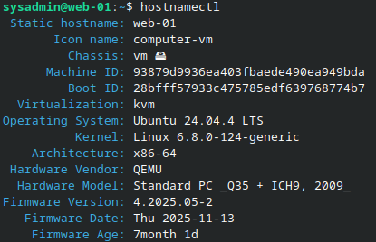
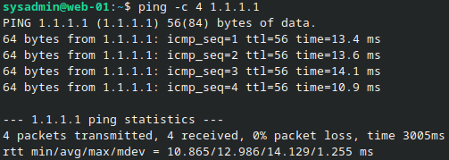
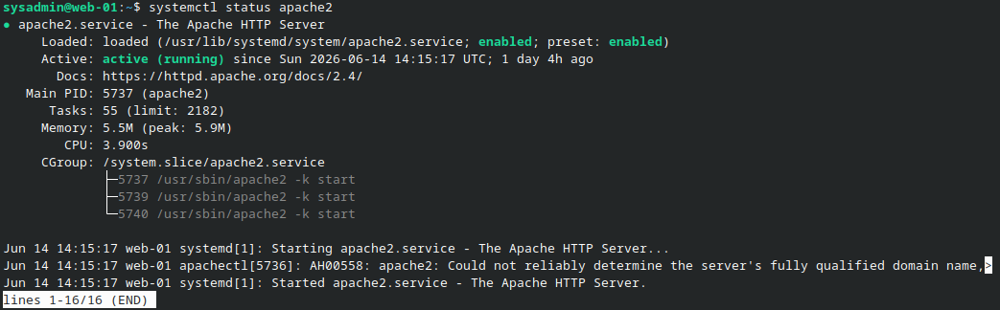
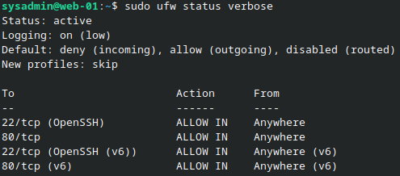
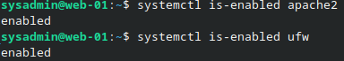
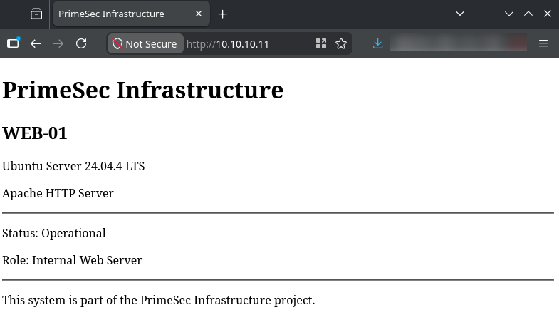

# WEB-01 Validation

## Purpose

This document records validation evidence for `WEB-01`.

Validation covers host identity, external connectivity, DNS resolution, Apache service state, `UFW` firewall policy, service startup, and web page access.

---

## Validation Summary

| Check | Result |
| --- | --- |
| Host identity | Passed |
| External connectivity | Passed |
| DNS resolution | Passed |
| Apache service status | Passed |
| Firewall configuration | Passed |
| Service startup configuration | Passed |
| Website access | Passed |

---

## Host Identity Validation

### Objective

Verify the operating system and visible hostname for `WEB-01`.

### Procedure

```bash
hostnamectl
```

### Result

The evidence shows:

- Static hostname: `web-01`
- Operating system: Ubuntu `24.04.4 LTS`
- Kernel: Linux `6.8.0-124-generic`
- Virtualization: `kvm`
- Hardware vendor: QEMU

Public documentation uses the component name `WEB-01`.

### Evidence



---

## External Connectivity Validation

### Objective

Verify that `WEB-01` can reach an external network destination through the configured network path.

### Procedure

```bash
ping -c 4 1.1.1.1
```

### Result

The ping test completed successfully.

Recorded output:

- `4` packets transmitted
- `4` packets received
- `0%` packet loss

### Evidence



---

## DNS Resolution Validation

### Objective

Verify that `WEB-01` can resolve external domain names.

### Procedure

```bash
dig google.com
```

### Result

The DNS query completed successfully.

Recorded output:

- Query status returned `NOERROR`
- An `A` record response was returned for `google.com`
- Resolver shown in the output is `127.0.0.53#53`

This validates DNS resolution from `WEB-01`.

It does not, by itself, prove that `WEB-01` is querying `DC-01` / `10.10.10.10` directly, because the screenshot shows the local system resolver stub.

### Evidence


---

## Apache Service Validation

### Objective

Verify that Apache HTTP Server is running on `WEB-01`.

### Procedure

```bash
systemctl status apache2
```

### Result

The Apache service is loaded and active.

Recorded output:

- Service: `apache2.service`
- Description: The Apache HTTP Server
- Loaded state: `loaded`
- Startup state: `enabled`
- Active state: `active (running)`

### Evidence



---

## Firewall Validation

### Objective

Verify that `UFW` is enabled and enforcing the documented host firewall policy.

### Procedure

```bash
sudo ufw status verbose
```

### Result

The evidence shows `UFW` active with the following policy:

| Firewall Setting | Value |
| --- | --- |
| Status | Active |
| Logging | On, low |
| Default incoming policy | Deny |
| Default outgoing policy | Allow |
| Default routed policy | Disabled |
| New profiles | Skip |

Allowed inbound rules:

| Rule | Action |
| --- | --- |
| `22/tcp` / OpenSSH | Allow in |
| `80/tcp` | Allow in |
| `22/tcp` / OpenSSH IPv6 | Allow in |
| `80/tcp` IPv6 | Allow in |

### Evidence



---

## Service Startup Validation

### Objective

Verify that Apache and `UFW` are enabled to start automatically.

### Procedure

```bash
systemctl is-enabled apache2
systemctl is-enabled ufw
```

### Result

Both services returned:

```text
enabled
```

This confirms that Apache and `UFW` are enabled at startup.

### Evidence



---

## Website Access Validation

### Objective

Verify that the Apache web page is reachable through the documented internal URL.

### Procedure

The web service was accessed from a browser using:

`http://10.10.10.11`

### Result

The page loaded successfully.

The visible page content confirms:

- Project name: PrimeSec Infrastructure
- Component: `WEB-01`
- Operating system: Ubuntu Server `24.04.4 LTS`
- Service: Apache HTTP Server
- Status: Operational
- Role: Internal Web Server

### Evidence



---

## Conclusion

`WEB-01` is validated as an internal Ubuntu Server web component running Apache HTTP Server.

The available evidence confirms:

- Host identity as `web-01`
- Ubuntu Server `24.04.4 LTS`
- External connectivity
- DNS resolution
- Apache active/running and enabled
- `UFW` active with documented rules for SSH and HTTP
- Apache and `UFW` enabled at startup
- Web page access at `http://10.10.10.11`