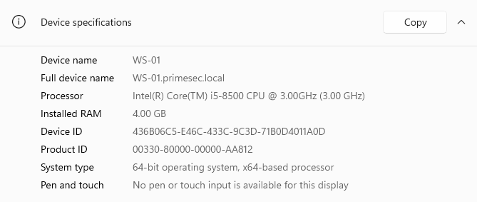
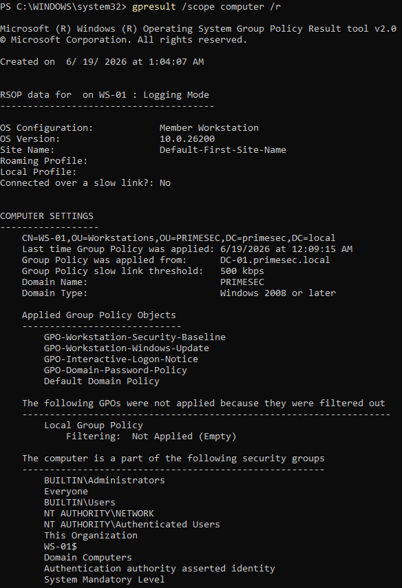
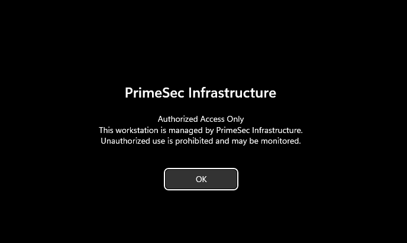

# Validation

Validation activities were performed to verify that WS-01 is operating correctly as a domain-joined workstation within the PrimeSec Infrastructure environment.

The objective of these validation procedures is to confirm successful integration with Active Directory, verify Group Policy processing, and demonstrate that centralized workstation management is functioning as designed.

The validation results confirm that WS-01 can communicate with domain services, receive centrally managed policies, and operate as a managed endpoint within the `primesec.local` domain.

---

## Domain Membership Validation

Domain membership validation was performed to confirm that WS-01 successfully joined the Active Directory domain and is recognized as a managed domain workstation.

The validation confirms:

- Hostname configured as **WS-01**
- Successful membership in the **primesec.local** domain
- Active Directory trust relationship established
- Workstation identity correctly registered within the domain

Validating domain membership is a foundational requirement for centralized authentication, Group Policy processing, and domain-based administration. Without successful domain integration, workstation management capabilities provided by Active Directory would not be available.

### Evidence

---

## Group Policy Processing Validation

Group Policy processing validation was performed to verify that WS-01 can successfully communicate with DC-01 and receive configuration data from Active Directory.

The validation confirms:

- Successful Group Policy processing
- Communication with domain services
- Retrieval of assigned policies
- Active participation in centralized management

The successful generation of Group Policy Results demonstrates that the workstation can consume policies distributed through Active Directory and apply centrally managed configuration settings.

This validation is important because Group Policy serves as the primary mechanism for centralized workstation administration within enterprise Windows environments.

### Evidence

---

## Applied Policy Validation

Policy validation was performed to confirm that assigned Group Policy Objects are being successfully applied to WS-01.

The validation confirms application of the following policies:

- GPO-Workstation-Security-Baseline
- GPO-Workstation-Windows-Update
- GPO-Interactive-Logon-Notice
- GPO-Domain-Password-Policy
- Default Domain Policy

Successful policy application demonstrates that workstation configuration is being managed centrally rather than through local administrative settings.

Centralized policy enforcement provides several operational advantages:

- Consistent workstation configuration
- Standardized security controls
- Reduced configuration drift
- Simplified administration
- Improved scalability

The ability to deploy and enforce policies from a central location is a fundamental capability of enterprise Windows administration.

### Evidence

---

## Interactive Logon Notice Validation

The interactive logon notice was validated to confirm successful deployment of user-facing Group Policy settings.

The validation confirms:

- The workstation successfully received the Interactive Logon Notice policy
- The security banner is displayed before user authentication
- User-facing Group Policy settings are applied correctly
- Centralized policy deployment is functioning as expected

The displayed banner provides an authorized-use notification and demonstrates successful communication between the workstation and Active Directory infrastructure.

This validation provides visible confirmation that workstation policies are being processed and enforced correctly on managed endpoints.

### Evidence

---

## Validation Summary

The validation activities performed on WS-01 confirm successful integration with the Active Directory environment and verify that centralized workstation management is operating as designed.

Validated capabilities include:

- Successful domain membership within `primesec.local`
- Functional Active Directory integration
- Successful Group Policy processing
- Centralized workstation management
- Consistent policy enforcement
- Successful deployment of user-facing security controls

The results demonstrate that WS-01 is functioning as a managed enterprise workstation and is successfully receiving administrative controls from DC-01.

Together, these validation activities confirm that Active Directory authentication, Group Policy management, and centralized workstation administration are operating correctly within the PrimeSec Infrastructure environment.